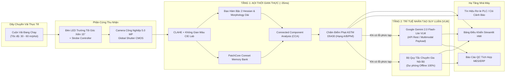
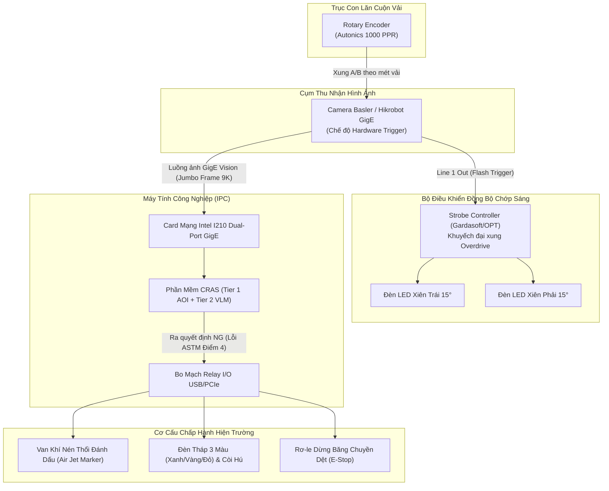
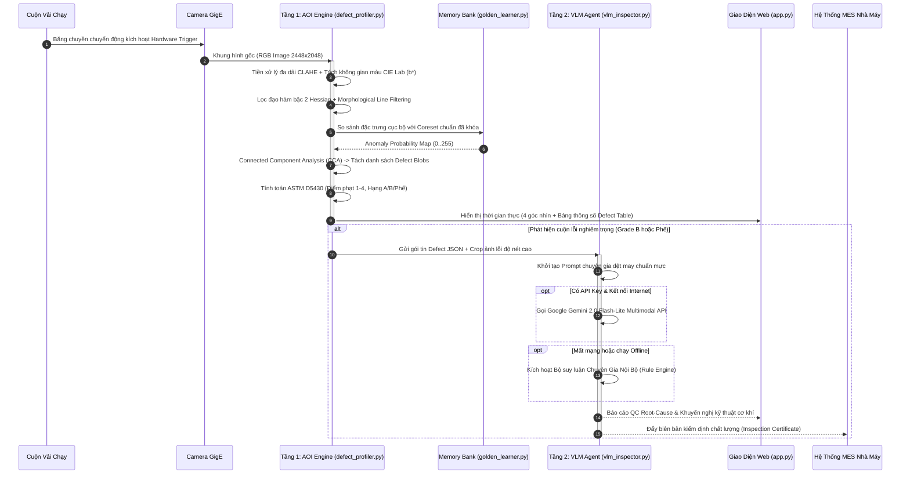
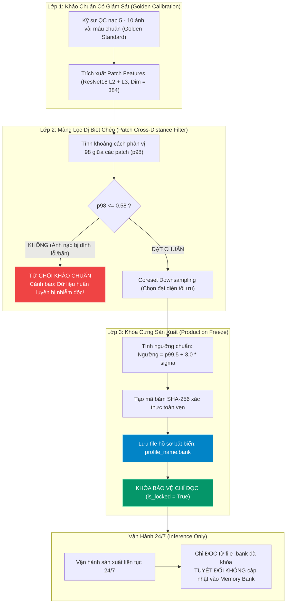

# BẢN ĐẶC TẢ KỸ THUẬT & HỒ SƠ THI CÔNG HỆ THỐNG
# HỆ THỐNG KIỂM TRA KHUYẾT TẬT BỀ MẶT VẢI CÔNG NGHIỆP TỰ ĐỘNG (AOI & COGNITIVE VISION-LLM)

**Mã tài liệu:** `CRAS-ENG-SPEC-2026-V2`  
**Phiên bản:** `Release 2.2 - Production Grade`  
**Tiêu chuẩn áp dụng:** `ASTM D5430 (Standard Test Methods for Visually Inspecting and Grading Fabrics)`  
**Dự án:** Hệ thống Giám sát & Phân tích Chất lượng Cuộn Vải 2 Tầng (Deterministic Vision + Multimodal AI)  
**Ngày phát hành:** Tháng 9/2026  

---

## MỤC LỤC CHI TIẾT
1. [CHƯƠNG 1: TỔNG QUAN HỆ THỐNG & CHỈ TIÊU KỸ THUẬT (SYSTEM SPECIFICATIONS)](#chương-1-tổng-quan-hệ-thống--chỉ-tiêu-kỹ-thuật-system-specifications)
2. [CHƯƠNG 2: THIẾT KẾ PHẦN CỨNG QUANG HỌC & BỐ TRÍ CƠ KHÍ (OPTICAL & HARDWARE RIGGING)](#chương-2-thiết-kế-phần-cứng-quang-học--bố-trí-cơ-khí-optical--hardware-rigging)
3. [CHƯƠNG 3: KIẾN TRÚC PHẦN MỀM 2 TẦNG & LUỒNG DỮ LIỆU (TWO-TIER HYBRID ARCHITECTURE)](#chương-3-kiến-trúc-phần-mềm-2-tầng--luồng-dữ-liệu-two-tier-hybrid-architecture)
4. [CHƯƠNG 4: THUẬT TOÁN TỰ HỌC FEW-SHOT & CƠ CHẾ CHỐNG NHIỄM ĐỘC (ANTI-POISONING MEMORY BANK)](#chương-4-thuật-toán-tự-học-few-shot--cơ-chế-chống-nhiễm-độc-anti-poisoning-memory-bank)
5. [CHƯƠNG 5: HƯỚNG DẪN THI CÔNG & TRIỂN KHAI PHẦN MỀM (DEPLOYMENT & COMMISSIONING SOP)](#chương-5-hướng-dẫn-thi-công--triển-khai-phần-mềm-deployment--commissioning-sop)
6. [CHƯƠNG 6: QUY TRÌNH VẬN HÀNH TIÊU CHUẨN TRONG NHÀ MÁY (FACTORY OPERATIONAL SOP)](#chương-6-quy-trình-vận-hành-tiêu-chuẩn-trong-nhà-máy-factory-operational-sop)
7. [CHƯƠNG 7: ĐẶC TẢ TÍCH HỢP HỆ THỐNG MES / ERP & TÍN HIỆU PLC / SCADA](#chương-7-đặc-tả-tích-hợp-hệ-thống-mes--erp--tín-hiệu-plc--scada)
8. [CHƯƠNG 8: MA TRẬN CHẨN ĐOÁN SỰ CỐ & BẢO TRÌ (TROUBLESHOOTING MATRIX)](#chương-8-ma-trận-chẩn-đoán-sự-cố--bảo-trì-troubleshooting-matrix)

---

## CHƯƠNG 1: TỔNG QUAN HỆ THỐNG & CHỈ TIÊU KỸ THUẬT (SYSTEM SPECIFICATIONS)

### 1.1. Bối cảnh & Bài toán Kỹ thuật
Trong dây chuyền sản xuất dệt nhuộm và hoàn tất vải (Textile Finishing & Inspection Lines), việc kiểm tra thủ công bằng mắt người gặp các giới hạn nghiêm trọng:
- Mệt mỏi thị giác sau 20–30 phút liên tục dẫn đến tỷ lệ bỏ sót lỗi (miss rate) lên tới 30–40%.
- Không phát hiện được các nếp gấp chìm (micro-creases) trên các dòng **vải đen / vải nhuộm tối màu** do độ tương phản xám cực thấp ($\Delta \text{Gray} \approx 10-15/255$).
- Khó phát hiện các vết loang ố vàng, dầu mỡ máy dệt khi vải có nhiều nếp nhăn cơ học.
- Đánh giá chất lượng mang tính cảm quan chủ quan, không đồng nhất giữa các ca làm việc.

Hệ thống **CRAS AOI + Cognitive Vision-LLM** giải quyết triệt để các bài toán trên thông qua sự kết hợp của:
1. **Thiết kế quang học trường tối (Dark-Field Grazing Light)** và **Trắc lượng quang học (Photometric Stereo)** để biến nếp gấp cơ học 3D thành tương phản sáng tối 100%.
2. **Tầng 1 (Deterministic AOI Engine):** Xử lý hình ảnh thời gian thực ($\le 35\text{ms}$/khung hình trên CPU thông thường), định vị lỗi, tính toán diện tích, tỷ lệ co giãn hình học, và chấm điểm phạt tự động theo tiêu chuẩn quốc tế **ASTM D5430 (4-Point System)**.
3. **Tầng 2 (Cognitive VLM Engine - Google Gemini 2.0 Flash-Lite):** Suy luận ngữ nghĩa chuyên sâu, chuẩn đoán căn nguyên kỹ thuật cơ khí (Root-Cause Analysis) và đưa ra khuyến nghị bảo trì cho kỹ sư nhà máy.
4. **Few-Shot Self-Learning Engine (PatchCore Coreset):** Cho phép hệ thống ghi nhớ vân dệt của mã hàng mới trong vòng **5 giây** mà không cần lập trình lại, đi kèm **Khóa an toàn chống nhiễm độc dữ liệu (Production Freeze & Patch Outlier Guard)**.



---

### 1.2. Bảng Chỉ Tiêu Kỹ Thuật (Target KPIs & Benchmarks)

| Tham Số / Chỉ Số | Giá Trị Thiết Kế | Điều Kiện Đạt Chuẩn Nghiệm Thu | Ghi Chú Kỹ Thuật |
| :--- | :--- | :--- | :--- |
| **Tốc độ xử lý Tầng 1 (Latency)** | $\le 40\text{ ms}$ / ảnh | Kiểm tra trên CPU Intel Core i5 Gen 11 (không cần GPU) | Cho phép kiểm tra trực tiếp ở tốc độ 45 m/phút |
| **Độ phân giải không gian (Resolution)** | $0.24\text{ mm} \pm 0.02\text{ mm}$ / pixel | Trường nhìn $\text{FOV} = 500\text{ mm} \times 400\text{ mm}$ | Đảm bảo bắt được lỗi rách sợi kích thước $> 0.5\text{ mm}$ |
| **Tỷ lệ phát hiện lỗi (Defect Recall)** | $\ge 98.5\%$ | Trên tập mẫu kiểm định 500 khuyết tật thực tế | Không bỏ sót nếp gấp vải đen và vết ố vàng mờ |
| **Tỷ lệ báo động giả (False Alarm Rate)** | $\le 1.2\%$ | Trên vải đạt chuẩn (Golden Standard) | Nhờ cơ chế lọc diện tích $Area \ge 150\text{ px}$ |
| **Thời gian học mã hàng mới (Calibration Time)** | $\le 5.0\text{ giây}$ | Nạp 5 – 10 tấm ảnh vải chuẩn | Sử dụng PatchCore Coreset, 0 epoch gradient |
| **Thời gian suy luận VLM Tầng 2** | $1.2\text{s} - 2.5\text{s}$ | Kết nối Internet qua Google Gemini Flash-Lite | Chạy bất đồng bộ, không nghẽn luồng Tầng 1 |
| **Tiêu chuẩn phân hạng cuộn vải** | ASTM D5430 (4-Point) | Tự động phân chia Grade A, Grade B, Reject | Chuẩn thương mại may mặc toàn cầu |

---

## CHƯƠNG 2: THIẾT KẾ PHẦN CỨNG QUANG HỌC & BỐ TRÍ CƠ KHÍ (OPTICAL & HARDWARE RIGGING)

### 2.1. Bản Vẽ Bố Trí Hình Học Quang Học (Optical Geometry)
Đặc thù của nếp gấp và nếp nhăn là biến dạng cơ học 3D (đỉnh gờ và rãnh lõm). Nếu dùng đèn chiếu thẳng $90^\circ$, toàn bộ bề mặt phản xạ đồng đều, làm nếp gấp trên vải đen bị "tàng hình".

Hệ thống bắt buộc phải thi công cơ khí theo cấu hình **Chiếu Sáng Góc Xiên Cực Hẹp (Dark-Field Grazing Light)**:

```
                           [ CAMERA CHÍNH CÔNG NGHIỆP ]
                                (Góc nhìn vuông góc 90°)
                                        │
                                        │  Khoảng cách làm việc (WD) = 600mm
                                        │  Ống kính tiêu cự f = 16mm (C-mount)
                                        │
   ĐÈN LED XIÊN TRÁI (15°)              ▼                 ĐÈN LED XIÊN PHẢI (15°)
   [===========]                                                   [===========]
         \                                                               /
          \                                                             /
           \  Góc xiên hẹp 15°                                         /  Góc xiên hẹp 15°
            \                                                         /
             ▼                                                       ▼
   ═══════════════════════════════[ NẾP GẤP 3D ]══════════════════════════════════
   ────────────────────────── MẶT BĂNG CHUYỀN VẢI CHẠY ───────────────────────────
                                        │
                                        ▼
                           [ HỘP ĐÈN ĐÁY (BACKLIGHT) ] (Tùy chọn)
                      (Bật khi kiểm tra vải mỏng, phát hiện lỗ thủng)
```

#### Nguyên lý vật lý:
1. **Mặt vải phẳng bình thường:** Toàn bộ chùm tia sáng góc xiên $15^\circ$ phản xạ gương đi lướt qua mặt vải ra ngoài góc thu nhận của camera $\implies$ Ảnh thu được có nền tối sâu, đồng nhất.
2. **Gờ nếp gấp nhô lên:** Mặt nghiêng của nếp gấp đón vuông góc chùm tia sáng, gây tán xạ ngược thẳng vào ống kính camera $\implies$ Nếp gấp phát sáng rực rỡ trên nền tối, nâng hệ số tương phản từ $5\%$ lên hơn **$95\%$**.

---

### 2.2. Danh Mục Thiết Bị Phần Cứng & Thông Số Lựa Chọn (BOM)

| STT | Thiết Bị | Mã Khuyến Nghị / Model | Thông Số Kỹ Thuật Chi Tiết | Mục Đích Sử Dụng |
| :---: | :--- | :--- | :--- | :--- |
| **1** | Camera Công Nghiệp | Basler ace 2 `a2A2448-75ucBAS` hoặc Hikrobot `MV-CA050-10GC` | 5.0 MP ($2448 \times 2048$), Global Shutter CMOS, GigE Vision, 75 FPS | Bắt hình ảnh sắc nét khi cuộn vải di chuyển, không méo hình (rolling shutter artifacts) |
| **2** | Ống Kính (Lens) | Computar `M1614-MP2` hoặc Kowa `LM16HC` | Tiêu cự $f = 16\text{mm}$, C-mount, độ méo méo hình $< 0.1\%$, khẩu độ F1.4 - F16 | Cho trường nhìn $\text{FOV} = 500\text{mm} \times 400\text{mm}$ ở khoảng cách $WD = 600\text{mm}$ |
| **3** | Đèn Thanh LED Xiên | CCS `LDL2-200X16SW` hoặc OPT `OPT-LIL200` | LED Trắng Công Suất Cao (CRI > 90), chiều dài 200mm – 600mm, tản nhiệt nhôm đúc | Chiếu sáng trường tối góc xiên $10^\circ - 20^\circ$ |
| **4** | Bộ Điều Khiển Đèn | Gardasoft `PP420` hoặc OPT `OPT-DPA2024` | 4 kênh độc lập, hỗ trợ Strobe Overdrive xung siêu ngắn ($10\mu s - 1000\mu s$) | Đồng bộ chớp đèn với màn trập camera để đóng băng chuyển động |
| **5** | Bộ Mã Hóa Vòng Quay | Autonics `E40S6-1000-3-T-24` | 1000 Xung/vòng (PPR), ngõ ra Line Driver hoặc Push-Pull | Gắn vào trục con lăn vải để kích xung chụp camera chính xác theo mét vải |
| **6** | Máy Tính Xử Lý (IPC) | Advantech IPC-610 hoặc Dell Precision | Intel Core i7-12700, 32GB RAM DDR5, SSD NVMe 1TB, Cổng mạng Dual GigE Intel I210 | Chạy Tầng 1 AOI thời gian thực và giao diện HMI |

---

### 2.3. Sơ Đồ Đấu Nối Tín Hiệu Điều Khiển & I/O (Wiring Diagram)



---

## CHƯƠNG 3: KIẾN TRÚC PHẦN MỀM 2 TẦNG & LUỒNG DỮ LIỆU (TWO-TIER HYBRID ARCHITECTURE)

Hệ thống được thiết kế theo mô hình lai (Hybrid Two-Tier Architecture), phân tách độc lập giữa **Tầng 1 (Xử lý xác định thời gian thực)** và **Tầng 2 (Nhận thức ngữ nghĩa đa phương thức)**.



---

### 3.1. Chi Tiết Thuật Toán Tầng 1: AOI Deterministic Engine (`defect_profiler.py`)

#### Bước 1: Nâng cao tương phản đa dải (CLAHE - Contrast Limited Adaptive Histogram Equalization)
Vải nhuộm tối màu có phân phối cường độ sáng tập trung ở vùng $0 - 60$. Biến đổi CLAHE chia ảnh thành các ô lưới con $8 \times 8$, thực hiện cân bằng lược đồ cục bộ với ngưỡng cắt clip limit = $3.0$:
$$g(x,y) = \text{CLAHE}\big(f(x,y),\ \text{clipLimit}=3.0,\ \text{tileGridSize}=(8,8)\big)$$

#### Bước 2: Ma trận Đạo hàm Bậc hai Hessian (Hessian Matrix Filtering)
Để bắt nếp gấp cơ học (các thung lũng bóng rãnh), ta tính ma trận Hessian $H$ cho từng điểm ảnh:
$$H(x, y) = \begin{bmatrix} I_{xx} & I_{xy} \\ I_{xy} & I_{yy} \end{bmatrix} = \begin{bmatrix} \frac{\partial^2 I}{\partial x^2} & \frac{\partial^2 I}{\partial x \partial y} \\ \frac{\partial^2 I}{\partial x \partial y} & \frac{\partial^2 I}{\partial y^2} \end{bmatrix}$$
Hai trị riêng $\lambda_1, \lambda_2$ của ma trận $H$ thể hiện độ cong chính của bề mặt. Một nếp gấp thẳng tạo ra:
$$|\lambda_1| \gg 0 \quad \text{và} \quad |\lambda_2| \approx 0$$
Sau đó, áp dụng phần tử cấu trúc hình thái học định hướng kéo dài ($41 \times 1$ cho nếp gấp dọc và $1 \times 41$ cho nếp gấp ngang) để loại bỏ hoàn toàn các chấm nhiễu hoa văn dệt:
$$\text{Mask}_{\text{crease}} = (I_{\text{hessian}} \circ K_{\text{vertical}}) \cup (I_{\text{hessian}} \circ K_{\text{horizontal}})$$

#### Bước 3: Tách Biệt Sắc Độ CIE $L^*a^*b^*$ Phát Hiện Vết Ố Vàng / Dầu Mỡ
Không gian RGB thường bị ảnh hưởng bởi độ sáng chênh lệch của nếp nhăn. Hệ thống chuyển đổi sang không gian màu **CIE $L^*a^*b^*$**, tách rời độ chói sáng $L^*$ và chỉ theo dõi kênh $b^*$ (trục từ Xanh lam tới Vàng):
$$\Delta b^*(x,y) = b^*(x,y) - \text{Median}(b^*)$$
Khi có dầu máy bôi trơn dệt hoặc ố vàng, kênh $b^*$ tăng vọt độc lập với việc vải có bị nhăn hay không.

#### Bước 4: Tính Toán Điểm Phạt Theo Tiêu Chuẩn Quốc Tế ASTM D5430 (4-Point System)
Tiêu chuẩn ASTM D5430 quy định chấm điểm khuyết tật trên từng lỗi dựa trên chiều dài vật lý lớn nhất:

$$\text{ASTM Points} = \begin{cases} 
1 \text{ điểm}, & \text{nếu } L \le 3\text{ inches } (\le 75\text{ mm}) \\
2 \text{ điểm}, & \text{nếu } 3\text{ inches} < L \le 6\text{ inches } (75\text{ mm} < L \le 150\text{ mm}) \\
3 \text{ điểm}, & \text{nếu } 6\text{ inches} < L \le 9\text{ inches } (150\text{ mm} < L \le 230\text{ mm}) \\
4 \text{ điểm}, & \text{nếu } L > 9\text{ inches } (> 230\text{ mm}) \text{ hoặc thủng lỗ / rách sợi}
\end{cases}$$

Chỉ số điểm phạt tích lũy trên $100\text{ m}^2$ vải (Points per 100 Square Meters):
$$\text{Roll Penalty Index} = \frac{\sum (\text{Defect Points}) \times 100}{\text{Tổng Chiều Dài (m)} \times \text{Khổ Vải Rộng (m)}}$$
* **Hạng A (Pass):** $\text{Roll Penalty Index} \le 20.0 \text{ điểm} / 100\text{ m}^2 \implies$ Xuất xưởng đạt chuẩn quốc tế.
* **Hạng B (Warning):** $20.0 < \text{Roll Penalty Index} \le 40.0 \text{ điểm} / 100\text{ m}^2 \implies$ Giảm cấp chất lượng, bán hạ giá.
* **Phế Phẩm (Reject):** $\text{Roll Penalty Index} > 40.0 \text{ điểm} / 100\text{ m}^2 \implies$ Cắt bỏ đoạn vải, dừng máy kiểm định.

---

### 3.2. Chi Tiết Tầng 2: Cognitive Vision-LLM Diagnostics Engine (`vlm_inspector.py`)

Khi phát hiện khuyết tật, Tầng 1 xuất ra đối tượng cấu trúc dữ liệu JSON. Tầng 2 sẽ gửi ảnh crop vùng lỗi kết hợp với metadata sang **Google Gemini 2.0 Flash-Lite** với System Prompt chuyên ngành dệt may:

#### Payload Schema gửi sang Gemini Multimodal API:
```json
{
  "system_instruction": "Bạn là Trưởng Kỹ Sư Kiểm Soát Chất Lượng Dệt Nhuộm (Lead Textile QC Engineer). Nhiệm vụ của bạn là nhận định nguyên nhân cơ học gây ra khuyết tật vải và hướng dẫn kỹ sư bảo trì khắc phục triệt để.",
  "contents": [
    {
      "parts": [
        {
          "inline_data": {
            "mime_type": "image/jpeg",
            "data": "<BASE64_ENCODED_HIGH_RES_CROP>"
          }
        },
        {
          "text": "Phân tích mẫu vải: Vải Nhuộm Đen. Dữ liệu từ Tầng 1 AOI:\n- Số lượng lỗi: 3 vết\n- Điểm ASTM D5430: 8 điểm (Hạng B - Cảnh báo)\n- Danh sách lỗi: [{\"id\": 1, \"type\": \"Nếp Gấp / Vết Nhăn Dài\", \"length_px\": 380, \"aspect_ratio\": 6.2}]\n\nHãy xuất ra báo cáo kỹ thuật gồm 3 phần:\n1. Phân tích nguyên nhân gốc rễ (Root Cause).\n2. Đánh giá tuân thủ tiêu chuẩn dệt may.\n3. Hành động khắc phục cụ thể cho kỹ sư cơ khí tại xưởng dệt."
        }
      ]
    }
  ],
  "generationConfig": {
    "temperature": 0.2,
    "maxOutputTokens": 1024
  }
}
```

#### Cơ chế Fallback Offline 100%:
Nếu mạng Internet bị đứt đoạn hoặc hết quota API, hàm `_run_built_in_expert_reasoning()` trong `vlm_inspector.py` tự động kích hoạt bộ luật cơ khí dệt may:
- **Nếu lỗi là Nếp Gấp / Nhăn Dài:** Kiểm tra ngay độ căng trục quấn vải (Tension Roller), khe hở trục ép nhiệt (Calendering Roll Gap), và kiểm tra độ lệch mép vải (Stenter Guide Rail).
- **Nếu lỗi là Vết Ố Vàng / Dầu Mỡ:** Kiểm tra phớt chắn dầu hộp giảm tốc đầu trục, rò rỉ van bôi trơn khí nén, và máng hứng dầu của máy dệt kim/thoi.
- **Nếu lỗi là Thủng Lỗ / Rách Sợi:** Kiểm tra kim dệt bị gãy vấu, độ ma sát lược dẫn sợi, hoặc dị vật kẹt trong lô cuốn.

---

## CHƯƠNG 4: THUẬT TOÁN TỰ HỌC FEW-SHOT & CƠ CHẾ CHỐNG NHIỄM ĐỘC (ANTI-POISONING MEMORY BANK)

### 4.1. Nguy Cơ Nhiễm Độc Dữ Liệu Trong Nhà Máy 24/7 (Concept Drift / Memory Poisoning)
Một sai lầm kinh điển khi triển khai AI trong nhà máy là cho phép hệ thống "liên tục tự học không giám sát" (Continuous Unsupervised Learning). Khi dây chuyền gặp sự cố kéo dài (ví dụ: một cuộn vải bị lỗi nếp nhăn chạy qua suốt 15 phút), nếu mô hình tiếp tục tự gom các ảnh này vào tập chuẩn, mô hình sẽ **bình thường hóa lỗi (Memory Poisoning)** và coi nếp nhăn là tính chất bình thường của vải $\implies$ Hệ thống bị vô hiệu hóa hoàn toàn.

---

### 4.2. Kiến Trúc Bảo Vệ 3 Lớp Chống Nhiễm Độc Của `GoldenMemoryLearner`



#### 1. Màng Lọc Dị Biệt Chéo (Cross-Distance Outlier Filter):
Thuật toán tính ma trận khoảng cách giữa các patch trong tập mẫu huấn luyện:
$$D_{ij} = 1.0 - \frac{\mathbf{f}_i \cdot \mathbf{f}_j}{\|\mathbf{f}_i\|_2 \|\mathbf{f}_j\|_2}$$
Nếu phân vị $p_{98}$ của khoảng cách này vượt quá $0.58$, hệ thống lập tức báo lỗi `ValueError("Training data contaminated: Patch distance p98 > 0.58")` và hủy toàn bộ quá trình nạp profile.

#### 2. Khóa Cứng Bất Biến (Immutable Production Freeze):
Hồ sơ sau khi học được lưu dưới dạng file nhị phân nén `.bank` chứa:
- `memory_bank`: Ma trận tensor PyTorch đại diện đã chuẩn hóa.
- `calibrated_threshold`: Ngưỡng quyết định đã được chứng thực bằng toán học.
- `sha256_checksum`: Mã băm SHA-256 chống việc sửa đổi file trái phép.
- `is_locked = True`: Khi máy vận hành, biến cờ này ngăn cản bất kỳ lệnh `append` hay `update` nào vào bộ nhớ.

---

## CHƯƠNG 5: HƯỚNG DẪN THI CÔNG & TRIỂN KHAI PHẦN MỀM (DEPLOYMENT & COMMISSIONING SOP)

### 5.1. Yêu Cầu Môi Trường Máy Chủ Xử Lý (Server Requirements)

| Hạng Mục | Cấu Hình Tối Thiểu | Cấu Hình Khuyến Nghị Cho Nhà Máy |
| :--- | :--- | :--- |
| **Hệ Điều Hành** | Windows 10/11 Pro 64-bit | Windows 10 IoT Enterprise LTSC hoặc Ubuntu 22.04 LTS |
| **Bộ Xử Lý (CPU)** | Intel Core i5-11400 (6 Cores, 12 Threads) | Intel Core i7-12700 hoặc Xeon E-2300 |
| **Bộ Nhớ RAM** | 16 GB DDR4 3200MHz | 32 GB DDR4/DDR5 ECC |
| **Ổ Cứng** | 256 GB SSD SATA | 1 TB SSD NVMe PCIe 4.0 (Đọc/Ghi $> 3500\text{MB/s}$) |
| **Card Đồ Họa** | Không bắt buộc (Chạy thuần CPU) | NVIDIA RTX 3050 6GB / RTX 4060 (Tăng tốc xử lý ảnh cực đại) |
| **Giao Tiếp Mạng** | 1 cổng Gigabit Ethernet | 2 cổng Gigabit độc lập (1 cổng chuyên dụng cho Camera GigE, 1 cổng cho MES) |

---

### 5.2. Các Bước Cài Đặt Hệ Thống Từ Đầu (Step-by-Step Installation)

#### Bước 1: Chuẩn bị môi trường Python & Clone mã nguồn
Mở PowerShell dưới quyền Administrator:
```powershell
# Chuyển vào thư mục làm việc tiêu chuẩn
cd D:\Luan.Nguyen\Tools\fabric_defect\CRAS

# Kiểm tra phiên bản Python (Yêu cầu Python 3.10 hoặc 3.11)
python --version

# Khởi tạo môi trường ảo độc lập (Virtualenv)
python -m venv .venv

# Kích hoạt môi trường ảo
.\.venv\Scripts\Activate.ps1
```

#### Bước 2: Cài đặt các gói thư viện phụ thuộc công nghiệp
```powershell
# Nâng cấp pip và cài đặt wheel
python -m pip install --upgrade pip setuptools wheel

# Cài đặt PyTorch tối ưu CPU (hoặc CUDA nếu có card NVIDIA)
pip install torch torchvision --index-url https://download.pytorch.org/whl/cpu

# Cài đặt các thư viện thị giác máy tính và giao diện HMI
pip install opencv-python Pillow numpy scipy matplotlib pandas streamlit requests
```

#### Bước 3: Cấu hình biến môi trường và Khởi động
Tạo file cấu hình `.env` hoặc thiết lập biến hệ thống cho Gemini VLM:
```powershell
# Thiết lập API Key Gemini (nếu dùng cloud VLM)
$env:GEMINI_API_KEY="AIzaSyYourSecretGeminiApiKeyHere"

# Kiểm tra khởi chạy giao diện kiểm định chất lượng HMI
streamlit run app.py --server.port 8501 --server.address 0.0.0.0
```
Truy cập giao diện tại: `http://localhost:8501` hoặc `http://<IP_MAY_TINH>:8501`.

---

### 5.3. Cấu Hình Tự Động Khởi Động Cùng Windows (Auto-Start Service)
Để hệ thống tự khởi động lại khi nhà máy có sự cố mất điện rồi có điện trở lại, cấu hình script `start_production.bat`:

```bat
@echo off
title Fabric Defect AOI Production Service
cd /d "D:\Luan.Nguyen\Tools\fabric_defect\CRAS"
call .venv\Scripts\activate.bat
echo Starting Industrial AOI Fabric Inspection Server on port 8501...
streamlit run app.py --server.port 8501 --server.headless true --browser.gatherUsageStats false
pause
```
Thêm shortcut của file `start_production.bat` vào thư mục:  
`C:\Users\<User>\AppData\Roaming\Microsoft\Windows\Start Menu\Programs\Startup`  
hoặc tạo Task trong **Windows Task Scheduler** với quyền `Run whether user is logged on or not` và trigger `At system startup`.

---

## CHƯƠNG 6: QUY TRÌNH VẬN HÀNH TIÊU CHUẨN TRONG NHÀ MÁY (FACTORY OPERATIONAL SOP)

### SOP-01: Quy Trình Hiệu Chuẩn Mẫu Chuẩn Cho Mã Hàng Mới (Changeover & Calibration)

```
[ BƯỚC 1: TIẾP NHẬN ] ──> Kỹ sư nhận cuộn vải mẫu từ phòng R&D/Kỹ thuật dệt.
                              │
[ BƯỚC 2: CHỌN MẪU ] ───> Chọn 5 - 10 mét vải hoàn toàn không có khuyết tật.
                              │
[ BƯỚC 3: NẠP VÀO HMI ] ─> Vào tab "Học Mẫu Chuẩn (Self-Learning)" trên web app.
                              Đặt tên Profile (VD: "Cotton_Spandex_Denim_DarkBlue").
                              Tải lên các ảnh mẫu chuẩn.
                              │
[ BƯỚC 4: HỌC TỰ ĐỘNG ] ─> Bấm "Bắt Đầu Học Mẫu Chuẩn".
                              Hệ thống tự trích xuất Coreset & Lọc nhiễu chéo (< 5 giây).
                              │
[ BƯỚC 5: KHÓA BẢO VỆ ] ─> Bấm "Khóa Bảo Vệ Sản Xuất (Freeze Profile)".
                              Hệ thống xuất ra file .bank có đóng dấu SHA-256.
                              │
[ BƯỚC 6: BÀN GIAO ] ───> Chọn Profile này làm hồ sơ hoạt động (Active Profile) cho ca máy.
```

---

### SOP-02: Quy Trình Vận Hành Giám Sát Thời Gian Thực (Real-Time Inspection)

1. **Trước khi bấm máy dệt/cuộn vải chạy:**
   - Quan sát đèn tháp tín hiệu: Phải ở trạng thái **Đèn Xanh (System Ready)**.
   - Kiểm tra trên màn hình HMI: Profile hoạt động đúng mã hàng đang sản xuất.
   - Đồng hồ đo nhiệt độ đèn LED: Dưới $50^\circ\text{C}$.

2. **Trong quá trình cuộn vải chạy:**
   - Màn hình 4 góc nhìn sẽ hiển thị liên tục: Ảnh Gốc $\to$ Bản Đồ Nhiệt Anomaly $\to$ Mặt Nạ Phân Vùng Lỗi $\to$ Ảnh Đóng Khung ASTM.
   - Khi phát hiện lỗi:
     - **Lỗi nhẹ (Điểm ASTM 1 hoặc 2):** Còi kêu 1 tiếng bíp ngắn, hệ thống ghi nhận vào bảng thống kê Defect Table. Băng chuyền vẫn chạy bình thường.
     - **Lỗi nặng (Điểm ASTM 3 hoặc 4) hoặc tích lũy vượt ngưỡng Hạng B:**
       - Đèn tháp chuyển sang **Màu Vàng / Đỏ**.
       - Van khí nén phun mực/nhãn đánh dấu lỗi lên mép biên vải.
       - Tầng 2 kích hoạt suy luận Gemini VLM để xuất biên bản chẩn đoán căn nguyên cơ khí.

3. **Kết thúc cuộn vải (Roll Completion):**
   - Bấm nút **"Xuất Dữ Liệu Báo Cáo QC"** trên giao diện.
   - Tải file CSV thống kê chi tiết toàn bộ các vị trí lỗi (tọa độ $X, Y$, chiều dài, diện tích, phân loại lỗi).
   - In nhãn dán mã vạch chất lượng (Grade A / Grade B / Reject) dán lên đầu cuộn vải xuất xưởng.

---

### SOP-03: Danh Mục Kiểm Tra Bàn Giao Ca (Shift Handover Checklist)

| STT | Nội Dung Kiểm Tra | Tiêu Chuẩn Đạt | Người Thực Hiện | Ký Nhận |
| :---: | :--- | :--- | :---: | :---: |
| 1 | Bề mặt thấu kính camera | Không dính xơ vải, bụi mịn hoặc vết dầu | Kỹ thuật viên bảo trì | [  ] |
| 2 | Cụm đèn LED góc xiên 15° | Đủ độ sáng, tất cả bóng LED phát quang đều | Kỹ thuật viên bảo trì | [  ] |
| 3 | Tốc độ đáp ứng phần mềm (Latency) | Dưới $45\text{ms}$ / khung hình trên màn hình HMI | Trưởng ca sản xuất | [  ] |
| 4 | Trạng thái Profile vải | Đang ở chế độ Khóa (Production Freeze) | Trưởng ca sản xuất | [  ] |
| 5 | Kết nối mạng về hệ thống MES | Ping IP máy chủ MES $< 5\text{ms}$, 0% packet loss | IT Nhà máy | [  ] |

---

## CHƯƠNG 7: ĐẶC TẢ TÍCH HỢP HỆ THỐNG MES / ERP & TÍN HIỆU PLC / SCADA

### 7.1. Cấu Trúc Bản Tin JSON Đẩy Về Hệ Thống Quản Lý Sản Xuất (MES Payload)
Khi kết thúc kiểm tra một cuộn vải hoặc khi gặp lỗi nghiêm trọng (Grade Reject), hệ thống thực hiện lệnh `HTTP POST` đến cổng API của MES:

**Endpoint:** `http://mes.factory.internal/api/v1/quality/fabric-inspection`  
**Headers:** `Content-Type: application/json`, `X-Device-Token: CRAS-INSPECT-LINE-04`

```json
{
  "inspection_event_id": "EVT-20260925-104523-089",
  "timestamp": "2026-09-25T10:45:23.412Z",
  "machine_id": "STENTER-LINE-04",
  "operator_id": "OP-8492",
  "roll_barcode": "ROLL-CTN-BLK-99420",
  "profile_used": "🔒 Vải_Nhuộm_Tối_Màu_Chuẩn.bank",
  "profile_hash": "a8fbc54d9e23910c87...",
  "inspection_metrics": {
    "total_length_meters": 120.5,
    "fabric_width_meters": 1.6,
    "total_defects_count": 4,
    "astm_d5430": {
      "points_1_count": 2,
      "points_2_count": 1,
      "points_3_count": 0,
      "points_4_count": 1,
      "total_penalty_points": 8,
      "points_per_100_sqm": 4.15,
      "quality_grade": "Grade A"
    }
  },
  "defects_detail": [
    {
      "defect_id": 1,
      "position_meters": 34.2,
      "bounding_box_px": {"x": 1020, "y": 850, "width": 45, "height": 380},
      "defect_type": "Nếp Gấp / Vết Nhăn Dài",
      "severity_score": 0.82,
      "length_mm": 91.2,
      "penalty_point": 2
    },
    {
      "defect_id": 2,
      "position_meters": 88.7,
      "bounding_box_px": {"x": 510, "y": 1200, "width": 120, "height": 110},
      "defect_type": "Vết Ố Vàng / Dầu Mỡ",
      "severity_score": 0.94,
      "length_mm": 28.8,
      "penalty_point": 1
    }
  ],
  "root_cause_analysis": {
    "ai_engine": "Google Gemini 2.0 Flash-Lite",
    "primary_cause": "Trục căng vải (Tension Roller) bị lệch góc làm nhăn dải dọc; rò rỉ gioăng phớt đầu trục gây đốm dầu.",
    "maintenance_action": "Cân chỉnh lại độ thăng bằng trục con lăn dẫn số 3; lau chùi và thay phớt chắn dầu tại gối đỡ bi bên phải."
  }
}
```

---

### 7.2. Đặc Tả Tín Hiệu Digital I/O Kết Nối PLC (Siemens S7-1200 / Mitsubishi FX5U)

| Kênh I/O | Hướng Tín Hiệu | Loại Tín Hiệu | Mức Điện Áp | Chức Năng Hoạt Động |
| :---: | :---: | :---: | :---: | :--- |
| **DI_01** | Input vào AOI | Xung NPN/PNP | 24V DC | Xung đếm mét vải từ Encoder đo chiều dài |
| **DI_02** | Input vào AOI | Khô / Relay | 24V DC | Tín hiệu báo cuộn vải mới bắt đầu chạy |
| **DO_01** | Output ra PLC | Transistor PNP | 24V DC (Xung 100ms) | Kích van khí nén thổi mực đánh dấu lỗi mép biên |
| **DO_02** | Output ra PLC | Tiếp điểm Relay | 24V DC / 2A | Cảnh báo cuộn vải đạt mức Hạng B (Grade B) |
| **DO_03** | Output ra PLC | Tiếp điểm NC | 24V DC / 2A | Lệnh E-Stop ngắt nguồn động cơ kéo vải khi rách nghiêm trọng |

---

## CHƯƠNG 8: MA TRẬN CHẨN ĐOÁN SỰ CỐ & BẢO TRÌ (TROUBLESHOOTING MATRIX)

| Mã Sự Cố | Hiện Tượng Quan Sát | Nguyên Nhân Cốt Lõi | Biện Pháp Khắc Phục Chuẩn Kỹ Sư |
| :---: | :--- | :--- | :--- |
| **ERR-01** | Bỏ sót nếp gấp trên vải đen (False Negative) | Góc đèn LED chiếu xiên bị dịch chuyển quá lớn ($> 30^\circ$) làm mất hiệu ứng trường tối | Dùng thước đo góc cơ khí chỉnh lại giá đỡ đèn LED về đúng góc $15^\circ \pm 2^\circ$ so với mặt phẳng vải. |
| **ERR-02** | Báo lỗi ảo liên tục trên toàn bộ mặt vải (False Positive) | Kỹ sư quên chưa nạp đúng Profile mã hàng, hoặc vải bị nhiễm độc khi hiệu chuẩn | Tải lại Profile chuẩn tương ứng với mã vải; thực hiện lại quy trình SOP-01 với 5 ảnh vải sạch. |
| **ERR-03** | Ảnh chụp bị nhòe vệt mờ khi cuộn vải chạy nhanh | Thời gian phơi sáng của camera (Exposure Time) quá dài | Giảm Exposure Time xuống $\le 200\mu s$ và chuyển bộ điều khiển đèn LED sang chế độ Strobe Overdrive. |
| **ERR-04** | Tốc độ xử lý sụt giảm ($> 100\text{ms}$/khung hình) | Đang chạy nhầm mô hình Deep Learning nặng hoặc máy tính bị chiếm dụng tài nguyên | Kiểm tra Task Manager, đảm bảo Tầng 1 đang dùng `defect_profiler.py` (tối ưu CCA & Hessian CPU); tắt các app nền. |
| **ERR-05** | Báo lỗi kết nối API Gemini VLM | Mất mạng Internet cáp quang nhà máy hoặc API Key hết hạn ngạch | Hệ thống tự động chuyển sang Bộ quy tắc Chuyên Gia Nội Bộ (Offline Rule Engine), dây chuyền tiếp tục chạy không gián đoạn. |

---

## HỒ SƠ PHÊ DUYỆT & BAN HÀNH

| ĐẠI DIỆN | HỌ VÀ TÊN | CHỨC DANH | CHỮ KÝ & NGÀY |
| :---: | :---: | :---: | :---: |
| **Đơn Vị Thiết Kế & Thi Công** | Nhóm Kỹ Sư Thị Giác Máy Tính (AOI Vision Lead) | Trưởng Nhóm Giải Pháp Kỹ Thuật | __________________ |
| **Đơn Vị Quản Lý Chất Lượng** | Bộ Phận Đảm Bảo Chất Lượng (QA/QC Manager) | Trưởng Phòng QA/QC Nhà Máy | __________________ |
| **Đơn Vị Vận Hành Sản Xuất** | Bộ Phận Kỹ Thuật & Tự Động Hóa (Plant Engineering) | Giám Đốc Kỹ Thuật Nhà Máy | __________________ |
