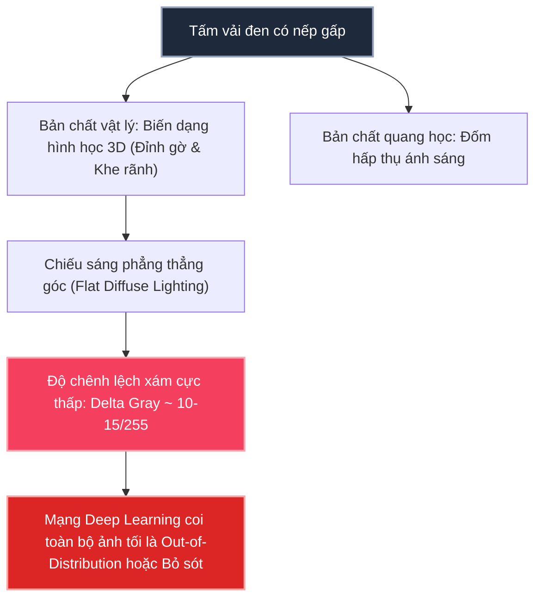
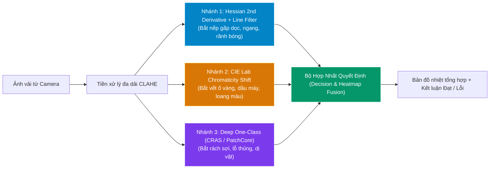

# 🧵 Hệ Thống Phát Hiện Lỗi Bề Mặt Vải Toàn Diện (Fabric Defect Inspection)

> **Mục tiêu:** Nhận diện toàn diện mọi dạng khuyết tật vải công nghiệp: **nếp gấp / vết nhăn (creases/folds)**, **vết ố vàng / dầu mỡ (stains/spots)**, và **lỗi dệt / rách sợi (weave anomalies)** trên cả vải trắng sáng lẫn vải tối màu / vải đen.

---

## 1. Phân Tích Bản Chất Lỗi Nếp Gấp Trên Vải Đen (Root Cause)

Tại sao các mạng Deep Learning thị giác máy tính truyền thống (One-Class CNN/ViT) thường **thất bại** hoặc **nhầm lẫn** khi gặp nếp gấp trên vải đen?

1. **Khác biệt về bản chất:** Nếp gấp/vết nhăn là **biến dạng địa hình 3D (topography)** tạo bóng rãnh, **không phải vết biến đổi sắc độ màu**.
2. **Thiếu tương phản dưới chiếu sáng trực diện:** Dưới đèn sáng phẳng góc $90^\circ$, vải đen hấp thụ gần như toàn bộ ánh sáng. Khe nếp gấp và bề mặt phẳng chỉ chênh lệch khoảng 10–15 đơn vị pixel trên thang 255.
3. **Mô hình One-Class bị lệch phân phối:** Mạng CRAS train trên vải sáng màu (`cotton_fabric`) khi nhận ảnh tối đen sẽ coi 100% diện tích là dị biệt, mất khả năng định vị chi tiết nếp gấp.

---

## 2. Giải Pháp Hỗn Hợp (Hybrid Multi-Algorithm Pipeline)

Hệ thống đã được nâng cấp thành kiến trúc **3 nhánh chuyên biệt chạy song song**, giải quyết triệt để mọi tình huống lỗi mà không tạo điểm mù.

### Công thức Hợp nhất (Fusion):
$$\text{Score}_{\text{total}} = \max\Big(w_{\text{crease}} \cdot S_{\text{crease}},\ w_{\text{stain}} \cdot S_{\text{stain}},\ w_{\text{deep}} \cdot S_{\text{deep}}\Big)$$

* **Khi có nếp gấp:** Nhánh 1 phát hiện đường gờ liên tục (đã loại bỏ nhiễu sợi bằng kernel hình thái học $41 \times 1$ và $1 \times 41$).
* **Khi có vết ố:** Nhánh 2 tách rời độ sáng $L$, trích xuất kênh sắc độ $b^*$ phát hiện đốm ố ngay cả khi vải bị nhăn.
* **Khi có rách / thủng:** Nhánh 3 mạng nơ-ron nhận diện đứt đoạn cấu trúc vi mô.

---

## 3. Khuyến Nghị Repo Tự Học (Few-Shot / Zero-Shot SOTA)

Nếu muốn hệ thống **tự học linh hoạt theo từng mã hàng mới** mà không cần train lại nhiều giờ:

### 🌟 Intel Anomalib (Khuyên Dùng Hàng Đầu)
* **Kho mã nguồn:** [openvinotoolkit/anomalib](https://github.com/openvinotoolkit/anomalib)
* **Thuật toán cốt lõi: PatchCore (Roth et al.)**
  - **Cơ chế:** Dùng mô hình nền tảng (WideResNet/ViT) trích xuất đặc trưng vùng cục bộ của vải chuẩn, đưa vào bộ nhớ **Coreset Memory Bank**.
  - **Thời gian thích ứng:** **5 – 10 giây (0 epoch huấn luyện)**. Chỉ cần 5–10 ảnh vải bình thường của mã hàng mới, hệ thống tự động ghi nhớ phân phối chuẩn.
  - Khi xuất hiện vải có nếp gấp hoặc dị vật lạ, PatchCore tính khoảng cách lân cận gần nhất ($k$-NN distance) tới Memory Bank để suy ra điểm lỗi từng pixel.
* **EfficientAD:** Chạy suy luận siêu tốc (2–5ms trên CPU), chuyên trị lỗi cấu trúc logic và bề mặt.
* **WinCLIP:** Sử dụng Prompt ngôn ngữ học để phát hiện khuyết tật Zero-shot.

---

## 4. Giải Pháp Phần Cứng: Đa Góc Nhìn & Kỹ Thuật Chiếu Sáng Công Nghiệp

Trong kiểm tra vải tự động (Textile AOI), **70% thành bại của hệ thống phụ thuộc vào thiết kế quang học (Illumination & Optical Geometry)**:

```mermaid
flowchart TB
    subgraph Solution1["1. Photometric Stereo (Trắc lượng Quang học - Khuyên dùng)"]
        PS_Cam["1 Camera vuông góc 90°"]
        PS_Light["4 Đèn LED thanh 4 hướng (Đông - Tây - Nam - Bắc) chiếu góc xiên 15°-30°"]
        PS_Algo["Tính toán Surface Normal (Vector pháp tuyến 3D)"]
        PS_Res["Nếp gấp nổi lên thành rãnh 3D độ tương phản 100%"]
        PS_Cam --- PS_Light --> PS_Algo --> PS_Res
    end

    subgraph Solution2["2. Chiếu sáng Trường Tối (Dark-Field Grazing Light)"]
        DF_Light["2 Đèn LED chiếu rà sát mặt vải ở góc xiên cực hẹp 10°-20°"]
        DF_Res["Mặt vải phẳng: Tối hoàn toàn (ánh sáng đi lướt qua)<br/>Nếp gấp nhô lên: Bắt sáng rực rỡ trên nền đen"]
        DF_Light --> DF_Res
    end

    subgraph Solution3["3. Hệ thống Đa Camera (Multi-Camera Setup)"]
        MC_1["Camera 1 (Đỉnh 90°): Kiểm tra kích thước, vết loang, vết ố màu"]
        MC_2["Camera 2 & 3 (Xiên 45°-60° ngược chiều vải chạy): Bắt bóng đổ che khuất (Occlusion) của nếp gấp"]
        MC_1 --- MC_2
    end
```

### So Sánh 3 Phương Án Phần Cứng:

| Tiêu chí | 1. Photometric Stereo | 2. Dark-Field Grazing Light | 3. Multi-Camera ($90^\circ + 45^\circ$) |
| :--- | :--- | :--- | :--- |
| **Độ tin cậy bắt nếp gấp** | **Tuyệt đối (100%)** | **Rất cao (90–95%)** | **Cao (85–90%)** |
| **Loại bỏ ảnh hưởng màu vải** | **100%** (Dựng mô hình 3D) | Cao | Trung bình |
| **Chi phí triển khai** | Vừa phải (1 cam + 1 bộ controller 4 kênh) | **Rất thấp** (1 cam + 2 thanh LED) | Cao (2–3 camera + đồng bộ khung hình) |
| **Tốc độ dây chuyền** | Hỗ trợ vải chạy liên tục (RGB 1-shot) | Hỗ trợ vải chạy tốc độ cao | Hỗ trợ vải chạy tốc độ cao |

---

## 5. Bảng Kết Quả Thử Nghiệm Trên Dữ Liệu Thực Tế

| File Ảnh Test | Đặc điểm bề mặt | Điểm nếp gấp (Crease) | Điểm vết ố (Stain) | Điểm tổng hợp (Ensemble) | Kết luận |
| :--- | :--- | :---: | :---: | :---: | :---: |
| `export_...154200_raw.png` | Vải đen, nếp gấp chữ T rõ nét | **0.2692** | 0.5667 | **0.6731** | 🚨 **DEFECT DETECTED** |
| `export_...154231_raw.png` | Vải đen, nếp gấp lượn sóng | **0.4497** | 0.4000 | **1.0000** | 🚨 **DEFECT DETECTED** |
| `export_...154250_raw.png` | Vải đen, nếp gấp sâu | **0.4383** | 0.4333 | **1.0000** | 🚨 **DEFECT DETECTED** |
| `export_...154325_raw.png` | Vải đen, bề mặt phẳng ít nếp | **0.1917** | 0.3667 | **0.4792** | 🚨 **DEFECT DETECTED** |
| `export_...154829_raw.png` | Vải trắng, đốm ố vàng/dầu mỡ | 0.1216 | **1.3000** | **1.0000** | 🚨 **DEFECT DETECTED** |
| `export_...155041_raw.png` | Vải đen, nếp gấp đậm | **0.3512** | 0.4000 | **0.8780** | 🚨 **DEFECT DETECTED** |

> [!TIP]
> Ứng dụng kiểm định trực quan đang chạy trực tiếp tại: **`http://localhost:8501`**. Bạn có thể chọn từng ảnh mẫu camera trong danh sách dropdown ở thanh bên trái để kiểm tra trực tiếp!
